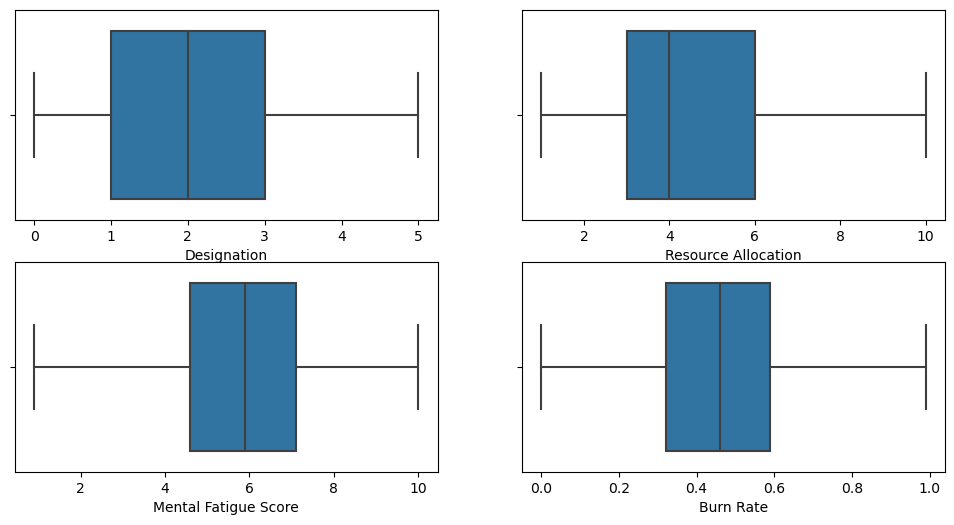

# Laporan Proyek Machine Learning - Muhamad Fahmi Al Kautsar

## Daftar Isi

- [Domain Proyek](#domain-proyek)
- [Business Understanding](#business-understanding)
- [Data Understanding](#data-understanding)
- [Data Preparation](#data-preparation)
- [Modeling](#modeling)
- [Evaluation](#evaluation)
- [Referensi](#referensi)

## Domain Proyek

Proyek ini akan membahas fenomena "burning out" atau kelelahan yang dialami oleh karyawan di perusahaan untuk mengetahui prediksi tingkat burn out karyawan berdasarkan faktor-faktor yang mempengaruhinya yang di antaranya: _lama bekerja_, _jenis kelamin_, _tipe perusahaan (produk atau jasa)_, _ketersediaan WFH (Work From Home)_, _pangkat_, _beban kerja_, dan _kelelahan_.

Burn out atau kelelahan kronis di tempat kerja merupakan masalah yang sering dialami oleh karyawan. Survei yang dilakukan Microsoft pada 20.000 orang di 11 negara antara Juli dan Agustus 2022 mengatakan bahwa 50% pekerja kelelahan dan 'paranoia produktivitas' dapat memperburuknya: 'Orang-orang lelah' Burnout bukanlah fenomena baru — tetapi lingkungan kerja hybrid dapat memperburuknya. [[1]](https://www.cnbc.com/2022/10/06/microsoft-50-percent-of-people-are-burned-out-at-work.html). Burn out dapat menyebabkan berbagai masalah bagi individu yang mengalaminya, seperti masalah kesehatan mental, fisik, dan emosional, serta menurunnya produktivitas dan kinerja [[2]](https://www.djkn.kemenkeu.go.id/artikel/baca/13618/Burn-Out-dalam-Bekerja-dan-Upaya-Mengatasinya.html).

Banyak faktor yang mempengaruhi tingkat kelelahan karyawan di tempat kerja di antaranya adalah lama bekerja, jenis kelamin, tipe perusahaan (produk atau jasa), ketersediaan WFH (Work From Home), pangkat, beban kerja, dan kelelahan.

Proyek ini akan meneliti faktor-faktor tersebut dengan menggunakan data yang diperoleh dari kaggle (https://www.kaggle.com/code/joshuamiguelcruz/exploring-various-linear-models-in-scikit-learn) dengan menggunakan _predictive analytics_ untuk mengetahui prediksi tingkat _burn out_ karyawan di tempat kerja berdasarkan faktor-faktor yang mempengaruhinya.

## Business Understanding

### Problem Statement

Berdasarkan latar belakang di atas, diperoleh rumusan masalah pada proyek ini, yaitu:

1. Bagaimana cara melakukan tahap persiapan data sebelum digunakan untuk pelatihan model _machine learning_?
2. Bagaimana cara membuat model _machine learning_ untuk memprediksi tingkat _burn out_ karyawan di tempat kerja?

### Goals

Berdasarkan rumusan masalah di atas, maka diperoleh tujuan dari proyek ini, yaitu:

1. Melakukan tahap persiapan data agar data yang digunakan dapat dipakai untuk melatih model _machine learning_.
2. Membuat model _machine learning_ dalam memprediksi tingkat _burn out_ karyawan di tempat kerja dengan tingkat _error_ model _machine learning_ yang cukup rendah.

### Solution Statements

Berdasarkan rumusan masalah dan tujuan di atas, maka disimpulkan beberapa solusi yang dapat dilakukan untuk mencapai tujuan dari proyek ini, yaitu:

1. Tahap persiapan data dilakukan dengan menggunakan beberapa teknik, yakni:

   - Melakukan proses _encoding_ fitur kategori dataset, yaitu kategori _Gender_, _Company Type_, dan _WFH Setup Available_ menggunakan _one-hot-encoding_, sehingga diperoleh fitur baru yang mewakili masing-masing variabel kategori.
   - Melakukan proses membagi dataset menjadi data latih dan data uji dengan perbandingan 90 : 10 dari total seluruh dataset yang akan digunakan saat membuat model _machine learning_.
   - Melakukan proses standarisasi fitur numerik menjadi bentuk data yang lebih mudah dipahami dan diolah oleh model _machine learning_.

2. Tahap membuat model _machine learning_ untuk memprediksi tingkat _burn out_ karyawan di tempat kerja dilakukan menggunakan model _machine learning_ dengan 3 algoritma yang berbeda dan kemudian akan dilakukan evaluasi model untuk membandingkan performa model yang terbaik. Algoritma yang akan digunakan, yaitu Boosting Algorithm, Algoritma K-Nearest Neighbor, dan Algoritma Random Forest.

   - **Algoritma Boosting**

     Algoritme boosting menilai prediksi model dan meningkatkan bobot sampel dengan kesalahan yang lebih signifikan. Algoritme ini juga menetapkan bobot berdasarkan performa model. [[3]](https://aws.amazon.com/id/what-is/boosting/).

     

     **Gambar 1. Ilustrasi Boosting Algorithm**

     Algoritma ini menggabungkan beberapa model sederhana (weak learners) menjadi satu model yang kuat (strong ensemble learner). Cara kerja algoritma boosting adalah dengan menyesuaikan model sederhana terhadap data yang salah diprediksi oleh model sebelumnya, sehingga model yang dihasilkan akan lebih akurat dalam memprediksi data baru

   - **Algoritma K-Nearest Neighbor**

     K-Nearest Neighbor mencari jarak terdekat antara data yang akan di evaluasi dengan k tetangga (neighbor) dalam data pelatihan [[4]](https://www.neliti.com/publications/155397/klasifikasi-buah-belimbing-berdasarkan-citra-red-green-blue-menggunakan-knn-dan#cite). Tujuan dari algoritma KNN adalah untuk mengklasifikasi objek baru berdasarkan atribut dan training samples.

     

     **Gambar 2. Ilustrasi algoritma K-Nearest Neighbor**

     Pada gambar di atas, terdapat sejumlah _data point_ yang dibagi menjadi dua kelas, yaitu kelas A dan kelas B. Jika ada data baru yang ingin diprediksi kelasnya menggunakan algoritma KNN, maka algoritma ini akan menghitung jarak antara data baru tersebut dengan data tetangga terdekat lainnya. Nilai k yang digunakan adalah 3, yang artinya akan diambil 3 data tetangga terdekat dari data baru tersebut. Setelah jarak dihitung, diperoleh 3 data tetangga terdekat yang terdiri dari 2 data kelas B dan 1 data kelas A. Kemudian, data baru tersebut akan diprediksi masuk ke dalam kelas B.

     Ada beberapa teknik yang dapat digunakan untuk menghitung jarak antar data menggunakan metrik, yaitu:

     - Euclidean Distance
       $$d(a,b)=\sqrt{\sum_{i=1}^n (a_i-b_i)^2}$$
     - Manhattan Distance
       $$d(a,b)=\sum_{i=1}^n |a_i-b_i|$$
     - Hamming Distance
       $$d(a,b)=\frac{1}{n}\sum_{n=1}^{n=n} |a_i-b_i|$$
     - Minkowski Distance
       $$d(a,b)=\left(\sum_{i=1}^n |a_i-b_i|^p\right)^\frac{1}{p}$$

   - **Algoritma Random Forest**

     Algoritma Random Forest merupakan algoritma yang menggabungkan output dari beberapa _decision tree_ untuk mencapai suatu hasil. Algoritma ini dibentuk dari banyak pohon yang diperoleh melalui proses _bagging_ atau _bootstrap aggregating_, di mana akan terdapat beberapa model yang dilatih dengan cara _random sampling with replacement_. [[5]](https://www.trivusi.web.id/2022/08/algoritma-random-forest.html) Tahap finalnya adalah menggabungkan masing-masing pohon sehingga diperoleh akurasi yang lebih tinggi dan mencegah adanya overfitting.

     

     **Gambar 3. Ilustrasi algoritma Random Forest**

     Proses klasifikasi pada random forest berawal dari memecah data sampel yang ada kedalam decision tree secara acak. Setelah pohon terbentuk,maka akan dilakukan voting pada setiap kelas dari data sampel. Kemudian, mengkombinasikan vote dari setiap kelas kemudian diambil vote yang paling banyak.

## Data Understanding

Dataset yang digunakan dalam proyek ini adalah dataset [Are Your Employees Burning Out?](https://www.kaggle.com/datasets/blurredmachine/are-your-employees-burning-out?select=train.csv) yang diambil dari Kaggle dengan dataset _train.csv_ yang berjumlah 22750 baris.

Dari dataset tersebut, dilakukan penghapusan kolom yang tidak digunakan dalam proses pembuatan model, yaitu kolom _Employee ID_.

Selanjutnya, dilakukan proses _Exploratory Data Analysis_ (EDA) untuk mengetahui karakteristik dari dataset yang digunakan. Pada tahap ini, diperlihatkan deskripsi variabel dan deskripsi statistik, serta dilakukan pengecekan terhadap missing value, outlier, dan distribusi data.

1. **Deskripsi Variabel**

   Di sini, dilakukan pengecekan terhadap tipe data dari setiap variabel yang ada pada dataset.

   Berikut adalah informasi variabel dari dataset "Are Your Employees Burning Out?":

   **Tabel 1. Informasi Variabel**
   | # | Column | Non-Null Count | Dtype |
   |---|---------------------|------------------|-------|
   | 0 | Date of Joining | 22750 non-null | object|
   | 1 | Gender | 22750 non-null | object|
   | 2 | Company Type | 22750 non-null | object|
   | 3 | WFH Setup Available | 22750 non-null | object|
   | 4 | Designation | 22750 non-null | float64|
   | 5 | Resource Allocation | 21369 non-null | float64|
   | 6 | Mental Fatigue Score| 20633 non-null | float64|
   | 7 | Burn Rate | 21626 non-null | float64|

   Tabel di atas menunjukkan bahwa terdapat 4 kolom bertipe data _object_ dan 4 kolom bertipe data _float64_.

   Berikut keterangan dari tiap kolom di atas:
   - Date of Joining: Tanggal-waktu ketika karyawan telah bergabung dengan organisasi (contoh: 2008-12-30)
   - Gender: Jenis kelamin karyawan (Pria/Wanita)
   - Company Type: Jenis perusahaan tempat karyawan bekerja (Layanan/Produk)
   - WFH Setup Available: Apakah fasilitas bekerja dari rumah tersedia untuk karyawan (Ya/Tidak)
   - Designation: Penunjukan karyawan yang bekerja di organisasi.
      - Di kisaran [0.0, 5.0] lebih besar adalah penunjukan yang lebih tinggi.
   - Resource Allocation: Jumlah sumber daya yang dialokasikan kepada karyawan untuk bekerja, yaitu. jumlah jam kerja.
      - Dalam kisaran [1.0, 10.0] (lebih tinggi berarti lebih banyak sumber daya)
   - Mental Fatigue Score: Tingkat kelelahan mental yang dihadapi karyawan.
      - Dalam rentang [0.0, 10.0] dimana 0.0 berarti tidak ada kelelahan dan 10.0 berarti kelelahan total.
   - Burn Rate: Nilai yang perlu kita prediksi untuk setiap karyawan yang memberitahukan tingkat Burn out saat bekerja.
      - Pada rentang [0.0, 1.0] dimana semakin tinggi nilainya maka semakin banyak terjadi burn out.

   Nantinya, akan dilakukan _feature engineering_ terhadap variabel _Date of Joining_ untuk mengubahnya menjadi fitur _Days Employed_ dan menjadikannya sebagai fitur numerik. Kita dapat mengasumsikan bahwa semakin banyak hari yang dimiliki seseorang, maka semakin berpengalaman dia.

2. **Deskripsi Statistik**

   Deskripsi statistik ini bertujuan untuk mengetahui karakteristik dari setiap variabel yang ada pada dataset. Berikut adalah deskripsi statistik dari dataset "Are Your Employees Burning Out?" yang didapat dari fungsi `describe()`.

   **Tabel 2. Deskripsi Statistik**

   |       | Designation  | Resource Allocation | Mental Fatigue Score | Burn Rate    |
   | ----- | ------------ | ------------------- | -------------------- | ------------ |
   | count | 22750.000000 | 21369.000000        | 20633.000000         | 21626.000000 |
   | mean  | 2.178725     | 4.481398            | 5.728188             | 0.452005     |
   | std   | 1.135145     | 2.047211            | 1.920839             | 0.198226     |
   | min   | 0.000000     | 1.000000            | 0.000000             | 0.000000     |
   | 25%   | 1.000000     | 3.000000            | 4.600000             | 0.310000     |
   | 50%   | 2.000000     | 4.000000            | 5.900000             | 0.450000     |
   | 75%   | 3.000000     | 6.000000            | 7.100000             | 0.590000     |
   | max   | 5.000000     | 10.000000           | 10.000000            | 1.000000     |

   Berdasarkan output diatas, didapatkan deskripsi statistik yaitu:

   1. count: Jumlah sampel data
   2. mean: Nilai rata-rata
   3. std: Standar deviasi
   4. min: Nilai minimum
   5. 25%: Kuartil bawah/Q1
   6. 50%: Kuartil tengah/Q2/median
   7. 75%: Kuartil atas/Q3
   8. max: Nilai maksimum

3. **Pengecekan Missing Values**

   Setelah dicek, terdapat 1381 _missing values_ pada _Resource Allocation_, 2117 _missing values_ pada _Mental Fatigue Score_, dan 1124 _missing values_ pada _Burn Rate_. _Missing values_ akan dibersihkan dengan menghapus baris yang mengandung _missing values_.

   Pembersihan _missing values_ menyisakan 18590 baris data.

4. **Pengecekan Outliers**

   Pengecekan outlier dilakukan dengan menggunakan boxplot. Berikut adalah boxplot dari setiap variabel yang ada pada dataset.

   
   **Gambar 4. Grafik boxplot sebelum pembersihan _outliers_**

   Berdasarkan boxplot diatas, didapatkan outliers pada variabel _Mental Fatigue Score_ dan _Burn Rate_. Pembersihan outliers dilakukan dengan menggunakan metode IQR.

   Dengan batas bawah dengan rumus `Q1 - 1.5 * IQR` dan batas atas dengan rumus `Q3 + 1.5 * IQR` dengan `IQR = Q3 - Q1`.

   

   **Gambar 5. Grafik boxplot setelah pembersihan _outliers_**

   Pembersihan outliers menyisakan 18215 baris data.

5. **Pengecekan Distribusi Data**

   Pengecekan distribusi data dilakukan dengan menggunakan histogram. Berikut adalah histogram dari setiap variabel yang ada pada dataset.

   - Categorical Features

       

     **Gambar 6. Histogram dari setiap caregorical variabel**

   - Numerical Features

     

     **Gambar 7. Histogram dari setiap numberical variabel**

     Berdasarkan histogram diatas, didapatkan distribusi data yang normal pada variabel _Designation_, _Resource Allocation_, _Mental Fatigue Score_, dan _Burn Rate_. Sedangkan untuk variabel _Days Employed_ didapatkan distribusi data yang ragged plateau.

6. **Analisis Multivariate**

   Proses multivariate data analysis dilakukan pada masing-masing fitur: kategorial dan numerik.

   - Categorical Features
     Dilakukan pengecekan rata-rata _Burn Rate_ berdasarkan kategori dari setiap variabel kategorial.

       

     **Gambar 8. Rata-rata _Burn Rate_ berdasarkan kategori dari setiap variabel kategorial**

     Berdasarkan histogram di atas, diperoleh kesimpulan:

     - Rata-rata `Burn Rate` terhadap `Gender` memberikan sedikit pengaruh di mana rata-rata `Burn Rate` untuk `Gender` `Male` lebih tinggi dibandingkan `Gender` `Female`.
     - `Company Type` tidak memberikan pengaruh terhadap `Burn Rate` karena rata-rata `Burn Rate` untuk `Company Type` `Service` dan `Product` hampir sama.
     - Ketidaktersediaan WFH (Work From Home) membuat `Burn Rate` lebih tinggi dibandingkan yang tersedia.

   - Numerical Features
     Dilakukan pengecekan rata-rata _Burn Rate_ berdasarkan kategori dari setiap variabel numerik.

     

     **Gambar 9. Rata-rata _Burn Rate_ berdasarkan kategori dari setiap variabel numerik**

     Berdasarkan diagram di atas, dapat disimpulkan:

     - Fitur `Burn Rate` memiliki pola sebaran data dengan korelasi positif terhadap `Designation`, `Resource Allocation`, dan `Mental Fatigue Score`.
     - Fitur `Burn Rate` memiliki pola sebaran data yang tidak beraturan terhadap `Days Employed`, sehingga tidak memiliki korelasi.

7. **Analisis Korelasi**

   Analisis korelasi dilakukan heatmap. Berikut adalah hasil korelasi antar variabel.

   
   **Gambar 10. Korelasi antar variabel**

   Berdasarkan hasil korelasi diatas, didapatkan korelasi kuat positif antara variabel _Burn Rate_ dengan _Designation_, _Resource Allocation_, dan _Mental Fatigue Score_. Sedangkan untuk variabel _Days Employed_ tidak memiliki korelasi dengan variabel _Burn Rate_.

   Karena tidak memiliki korelasi dengan variabel _Burn Rate_, maka variabel _Days Employed_ akan dihapus dari dataset.

## Data Preparation

Tahap ini bertujuan untuk mempersiapkan data yang akan digunakan untuk proses training model. Tahapan yang dilakukan pada tahap ini adalah _encoding_ pada fitur kategori, pembagian atau _split_ dataset, dan proses standarisasi data.

1. **Encoding Fitur Kategori**

   Encoding dilakukan untuk mengubah data kategori menjadi bentuk numerik yang dapat diolah oleh algoritma pembelajaran mesin. Data kategori merupakan data yang terdiri dari kategori-kategori tertentu yang tidak dapat diproses _machine learning_ secara langsung, sehingga perlu dilakukan encoding terlebih dahulu. Teknik yang digunakan pada proyek ini adalah _One Hot Encoding_.

   Fitur yang akan di-encode adalah kategori _Gender_, _Company Type_, dan _WFH Setup Available_ sehingga akan menghasilkan 6 fitur baru dengan nama berupa kombinari dari nama fitur kategori dan nilai fitur kategori.

2. **Pembagian Dataset**

   Dataset dibagi menjadi 2 bagian, yaitu bagian training dan bagian validation dengan proporsi 90% untuk training dan 10% untuk validation.

   Pembagian dataset dilakukan dengan menggunakan fungsi `train_test_split` dari library `sklearn.model_selection` dengan proporsi 80% untuk training dan 20% untuk testing. Terdapat 18.215 total data yang akan dibagi menjadi 16.393 data untuk training dan 1.822 data untuk validation.

3. **Standarisasi Data**

   Standarisasi data dilakukan dengan menggunakan fungsi `StandardScaler` dari library `sklearn.preprocessing`. Standarisasi data dilakukan untuk mengurangi perbedaan skala antar variabel sehingga dapat mempercepat proses training model.

   **Tabel 3. Standarisasi Fitur Numerik**

   |       | Designation | Resource Allocation | Mental Fatigue Score |
   | ----- | ----------- | ------------------- | -------------------- |
   | 16069 | 0.717453    | 1.234325            | 0.943609             |
   | 2686  | -1.080896   | -1.260102           | -1.345841            |
   | 9730  | -1.080896   | -0.761217           | -0.954959            |
   | 8574  | -1.080896   | -0.761217           | 0.217686             |
   | 15992 | 0.717453    | 0.236554            | -0.229036            |

## Modeling

Pada tahap ini, dilakukan proses training model dengan menggunakan 3 algoritma yang berbeda, yaitu _Boosting_, _K-Nearest Neighbors_, dan _Random Forest_.

1. **Boosting Algorithm**

   Algoritma Boosting bertujuan untuk meningkatkan performa atau akurasi prediksi dengan menggabungkan beberapa model sederhana yang dianggap lemah (weak learners) menjadi suatu model yang kuat (strong ensemble learner). Cara kerja algoritma Boosting adalah dengan membentuk model baru yang dioptimalkan berdasarkan model sebelumnya yang dianggap kurang optimal. Pada algoritma Boosting, terdapat parameter `learning-rate` yang digunakan untuk menentukan bobot setiap regressor, dengan nilai 0.05. Parameter `random-state` digunakan untuk menentukan seed yang digunakan dalam proses pembuatan model, dengan nilai default 42.

   ```python
   boosting = AdaBoostRegressor(random_state=42, learning_rate=0.05)
   ```

- Kelebihan:
  - Tidak memerlukan pra-pemrosesan data apa pun, dan memiliki rutinitas bawaan untuk menangani data yang hilang
  - Dapat menangani data yang memiliki banyak fitur dengan baik
  - Dapat mengolah data yang berskala besar dengan cepat
- Kekurangan:
  - Membutuhkan waktu yang lama untuk di-training
  - Sensitif terhadap outlier dan data yang tidak akurat
  - Membutuhkan parameter yang harus di-tune dengan baik agar dapat menghasilkan model yang baik

2. **K-Nearest Neighbor (KNN)**

   Algoritma K-Nearest Neighbor (KNN) memprediksi nilai dari setiap data baru berdasarkan "kesamaan fitur" dengan data yang telah ada. Cara kerja algoritma ini adalah dengan membandingkan jarak antara data baru dengan data pelatihan lainnya, kemudian memilih sejumlah k tetangga terdekat (dengan k adalah sebuah angka positif). Pada algoritma KNN, terdapat parameter `n-neighbors` dengan nilai k = 10 dan `metric` bawaan yaitu minkowski. Parameter `n-neighbors` digunakan untuk menentukan jumlah tetangga terdekat yang akan diambil, sedangkan parameter `metric` digunakan untuk menentukan teknik yang digunakan untuk menghitung jarak antar data. [[6]](https://scikit-learn.org/stable/modules/generated/sklearn.neighbors.KNeighborsRegressor.html)
   
   ```python
   knn = KNeighborsRegressor(n_neighbors=10)
   ```

- Kelebihan:
  - Mudah digunakan dan tidak memerlukan proses training yang rumit
  - Tingkat akurasi yang cukup tinggi
- Kekurangan:
  - Membutuhkan waktu yang lebih lama untuk melakukan prediksi
  - Tidak dapat memproses data yang berskala besar dengan cepat
  - Membutuhkan penyimpanan memori yang cukup besar

3. **Algoritma Random Forest**

   Random Forest termasuk dalam kategori ensemble learning, yaitu kelompok model pembelajaran mesin yang bekerja secara bersama-sama untuk mencapai hasil yang lebih baik. Pada algoritma Random Forest, terdapat parameter `n-estimator` yang digunakan untuk menentukan jumlah pohon (trees) yang akan dibuat, dengan nilai default 50 pohon. Parameter `max-depth` digunakan untuk menentukan kedalaman atau panjang pohon, dengan nilai default 12. Parameter `random-state` digunakan untuk menentukan seed yang digunakan dalam proses pembuatan pohon, dengan nilai 42. Parameter `n-jobs` digunakan untuk menentukan jumlah pekerjaan yang dilakukan secara paralel, dengan nilai default -1 yang berarti semua pekerjaan dilakukan secara paralel.

   ```python
   RF = RandomForestRegressor(n_estimators=50, random_state=42, max_depth=12, n_jobs=1)
   ```

- Kelebihan:
  - Tingkat akurasi yang tinggi
  - Dapat menangani data yang tidak balance dengan baik
  - Dapat menghandle data yang memiliki banyak fitur dengan baik
  - Dapat mengolah data yang berskala besar dengan cepat
- Kekurangan:
  - Membutuhkan waktu yang lebih lama untuk di-training
  - Membutuhkan parameter yang harus di-tune dengan baik agar dapat menghasilkan model yang baik
  - Tidak dapat memberikan penjelasan yang detail mengenai proses yang digunakan untuk memprediksi data.

## Evaluation

Pada tahap ini, dilakukan proses evaluasi model yang telah dilatih dengan menggunakan _Mean Absolute Error_ (MAE).

$$MSE = \frac{1}{n} \sum_{i=1}^{n} (Y_i - \hat{Y}_i)^2$$

$n$ = jumlah dataset  
$\sum$ = _summation_/penjumlahan  
$Y_i$ = nilai sebenarnya  
$\hat{Y}_i$ = nilai prediksi

Sebelumnya, dilakukan proses _scaling_ terhadap fitur numerik pada data validation dengan menggunakan fungsi `transform` dari `StandardScaler`.

```python
X_val.loc[:, num_features] = scaler.transform(X_val.loc[:, num_features])
```

Berdasarkan hasil evaluasi, diperoleh nilai MAE sebagai berikut:

**Tabel 4. Hasil Evaluasi Model**

|              | Train    | Validation |
| ------------ | -------- | ---------- |
| Boosting     | 0.003867 | 0.003991   |
| KKN          | 0.002592 | 0.003174   |
| RandomForest | 0.002355 | 0.00313    |


**Gambar 11. Hasil Evaluasi Model**

Berdasarkan grafik di atas, dapat disimpulkan bahwa:

- Model Random Forest memiliki nilai MSE terkecil, yaitu 0.002355 pada data latih dan 0.00313 pada data validasi.
- Model K-Nearest Neighbor (KNN) memiliki nilai MSE 0.002592 pada data latih dan 0.003174 pada data validasi.
- Model Boosting Algorithm memiliki nilai MSE terbesar, yaitu 0.003867 pada data latih dan 0.003991 pada data validasi.

Terakhir, dilakukan proses prediksi terhadap data validation dengan menggunakan setiap model yang telah dilatih.

**Tabel 5. Hasil Prediksi Model**
| | y_true | Boosting | KKN | RandomForest |
| --- | ------ | -------- | --- | ------------ |
| 16752 | 0.63 | 0.65 | 0.65 | 0.62 |

Berdasarkan output tabel di atas dapat dilihat bahwa urutan algoritma yang paling mendekati dengan nilai y_true adalah Random Forest. Nilai y_true sebesar 0.63 dan nilai prediksi Random Forest sebesar 0.62.

---

Kesimpulan yang dapat ditarik dari hasil _predictive analysis_ pada kasus ini adalah bahwa model Random Forest memiliki nilai MSE terkecil, sehingga dapat dikatakan bahwa model Random Forest memiliki performa yang lebih baik dibandingkan dengan model Boosting Algorithm dan K-Nearest Neighbor (KNN).

## Referensi

[1] S. Morgan, "50% of workers are burned out and ‘productivity paranoia’ could be making it worse: ‘People are just worn down’", 6 October 2022. [Online]. Available: https://www.cnbc.com/2022/10/06/microsoft-50-percent-of-people-are-burned-out-at-work.html.

[2] P. Yenni Ratna, "Burn Out dalam Bekerja dan Upaya Mengatasinya", 27 December 2020. [Online]. Available: https://www.djkn.kemenkeu.go.id/artikel/baca/13618/Burn-Out-dalam-Bekerja-dan-Upaya-Mengatasinya.html.

[3] AWS, "Apa itu Boosting?", 2022. [Online]. Available: https://aws.amazon.com/id/what-is/boosting/.

[4] W. Retno N., et al., "Klasifikasi Buah Belimbing Berdasarkan Citra Red-green-blue Menggunakan Knn Dan Lda", 2013. [Online]. Available: https://www.neliti.com/publications/155397/klasifikasi-buah-belimbing-berdasarkan-citra-red-green-blue-menggunakan-knn-dan.

[5] Trivusi, "Algoritma Random Forest: Pengertian dan Kegunaannya", 17 September 2022. [Online]. Available: https://www.trivusi.web.id/2022/08/algoritma-random-forest.html.

[6] scikit-learn, "sklearn.neighbors.KNeighborsRegressor", 2022. [Online]. Available: https://scikit-learn.org/stable/modules/generated/sklearn.neighbors.KNeighborsRegressor.html.
